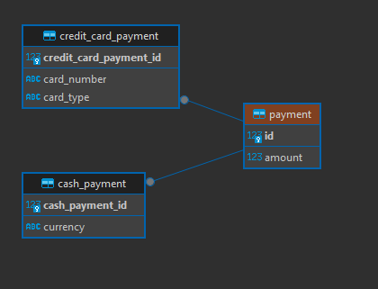

Joined Inheritance Type

#### Uses
- @Inheritance(strategy = InheritanceType.JOINED)
- Creates individual tables for base and subclasses
- Stores Individual entity properties in individual table and add ID from parent table to every child table and creates foreign key relationship
- Uses joins to fetching all the details

#### Query created by data jpa
```text
    create table payment (
        amount numeric(10,2),
        id bigint generated by default as identity,
        primary key (id)
    )

    create table credit_card_payment (
        id bigint not null,
        card_number varchar(255),
        card_type varchar(255),
        primary key (id)
    )
    
    create table cash_payment (
        id bigint not null,
        currency varchar(255),
        primary key (id)
    )
```
#### Schema ER Diagram



#### curl requests to insert and get data
```shell
curl --location 'http://localhost:8080/api/payments/credit-card-payment' \
--header 'Content-Type: application/json' \
--data '{
    "amount": 200.00,
    "cardNumber": "1111-2222-3333-4444",
    "cardType": "Amex"
}'

curl --location 'http://localhost:8080/api/payments/cash-payment' \
--header 'Content-Type: application/json' \
--data '{
    "amount": 75.25,
    "currency": "GBP"
}'

curl --location 'http://localhost:8080/api/payments'
```

#### Query to fetch records
```text
    select
        p1_0.id,
        case 
            when p1_1.id is not null 
                then 1 
            when p1_2.id is not null 
                then 2 
        end,
        p1_0.amount,
        p1_1.currency,
        p1_2.card_number,
        p1_2.card_type 
    from
        payment p1_0 
    left join
        cash_payment p1_1 
            on p1_0.id=p1_1.id 
    left join
        credit_card_payment p1_2 
            on p1_0.id=p1_2.id
```